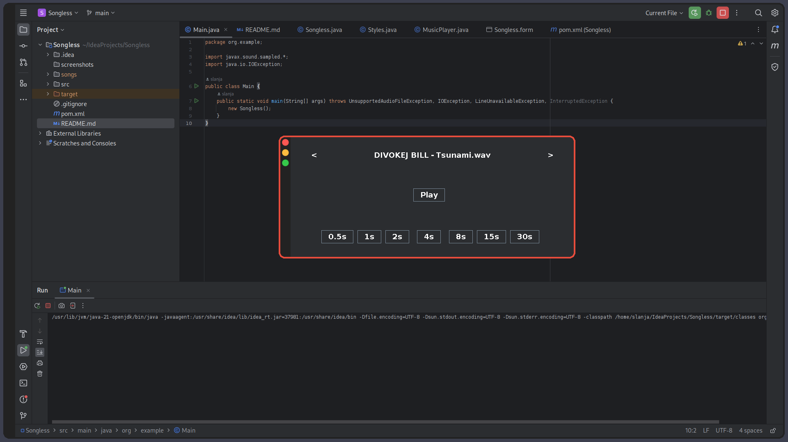

# Songless Clone

Songless Clone is a simple guessing game made using Java and JFrame. The game is a clone of the popular game "Songless," where the player has to guess the song using shorter duration.

## Features

* Plays .wav audio files
* Buttons for each duration the song can be played
* You can switch between audio files using buttons

## Screenshots



## Download Tutorial


Clone the repository from GitHub:

```shell
git clone https://github.com/slanja/songless.git
```

Change the directory to the cloned repository:

```shell
cd songless
```

Install the necessary dependencies:

```shell
npm install
```

Run the project:

```shell
npm start
```
## Contributors

<a href="https://github.com/slanja/songless/graphs/contributors">
  
</a>