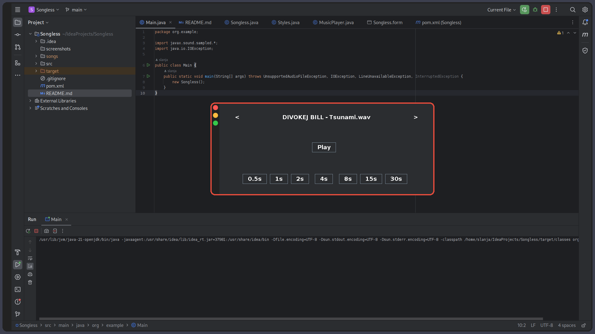

# 🎵 Songless Clone

Simple Java GUI app for playing a specific sequence of songs at reduced durations - can you guess them all?

## 📂 Table of contents
- [Introduction](#introduction)
- [Getting Started](#-getting-started)
- [Usage](#usage)
- [Technical Details](#-technical-details)

## 📑 Introduction
I created this application as a fun guessing game inspired by the popular "Songless" game. The idea is simple: can you identify songs when they're played for only a few seconds? This project taught me how to work with audio files in Java and create interactive GUI applications with JFrame.

## 🚀 Getting Started

Simply open the project in your IDE (IntelliJ IDEA, Eclipse, etc.) and run it!

## ⚙️ Usage
1. Click the play buttons to hear the song at different durations
2. Try to guess which song is playing
3. Use the buttons to switch between different audio files in the sequence
4. Test your music knowledge!

  

## 🛠️ Technical Details
The main challenge was handling audio playback in Java and creating an intuitive GUI with JFrame buttons.

### How it works:
* **Audio Playback:** The app plays `.wav` audio files using Java's built-in audio capabilities.
* **Duration Buttons:** Multiple buttons allow you to play the song at different durations (e.g., 3 seconds, 5 seconds, 10 seconds).
* **File Switching:** Navigate through your song collection with dedicated buttons to switch between audio files.
* **Simple GUI:** Built with JFrame for a clean and responsive user interface.
